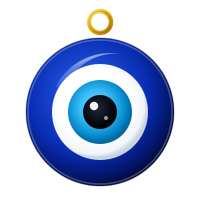

# Lucky Dangle

A desktop talisman and physics charm that hangs gracefully from the top-right corner of your screen on Windows.



---

## Features

- **Realistic Charms**:
  - **Nazar Evil Eye** (Matching traditional glass amulet with beads and golden cord)
  - **Maneki-Neko** (Golden Japanese lucky cat)
  - **Feng Shui Coin** (Prosperity coin with red mystic knot)
  - **Emerald Clover** (Four-leaf clover with dew drops)
  - **Celestial Amethyst** (Crystal shard with star gleam)
- **Custom Dangles Support**: Upload your own **PNG**, **GIF** (animated), **WebP**, **SVG**, or **JPG** image anytime!
- **System Tray Quick Access**:
  - **Single Left-Click on Tray Icon**: Instantly enable / disable (show / hide) the charm.
  - **Right-Click Menu**: Quick switch between dangles, select presets for size & hanging length, or open settings.
- **Top-Right Corner Placement**: Anchored to the top-right corner with customizable margin offset.
- **Live Customizer Panel**:
  - **Hanging Length Slider**: Adjust thread from short (30px) to long (220px).
  - **Charm Size Slider**: Scale charm from 50px to 200px.
  - **Right Margin Offset**: Fine-tune distance from screen edge.
  - **Swing Physics**: Adjust springiness and damping.
- **Synthesized Blessing Chime**: Plays harmonic bell chimes on blessing ritual (Ctrl+S).
- **True Click-Through Transparency**: Mouse clicks pass through the transparent area so it never blocks your desktop work.

---

## Controls & Shortcuts

| Action | Control |
|---|---|
| **Toggle Show / Hide** | **Left-Click** Tray Icon or press `Ctrl + D` |
| **Blessing Ritual & Chime** | Press `Ctrl + S` or click "Bless Now" |
| **Switch Dangles** | Right-click tray icon or open Customizer |
| **Open Settings** | Double-click tray icon or select "Settings & Customizer..." |
| **Interactive Physics** | Left-click & drag the charm with your mouse to swing/flick |

---

## Supported Custom Dangle Files

- **PNG (`.png`)**: Best with transparent background (recommended 256×256 to 512×512).
- **Animated GIF (`.gif`)**: Animated charms that sparkle or sway continuously.
- **WebP (`.webp`)**: High efficiency transparent & animated images.
- **SVG (`.svg`)**: Scalable vector art.
- **JPEG (`.jpg`, `.jpeg`)**: Standard photos.

---

## Development & Build

```bash
# Run locally
npm start

# Build Windows Installer / Executable
npm run dist
```
